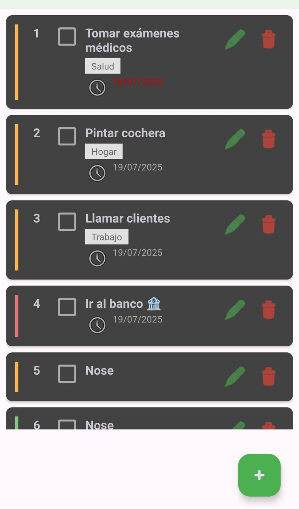
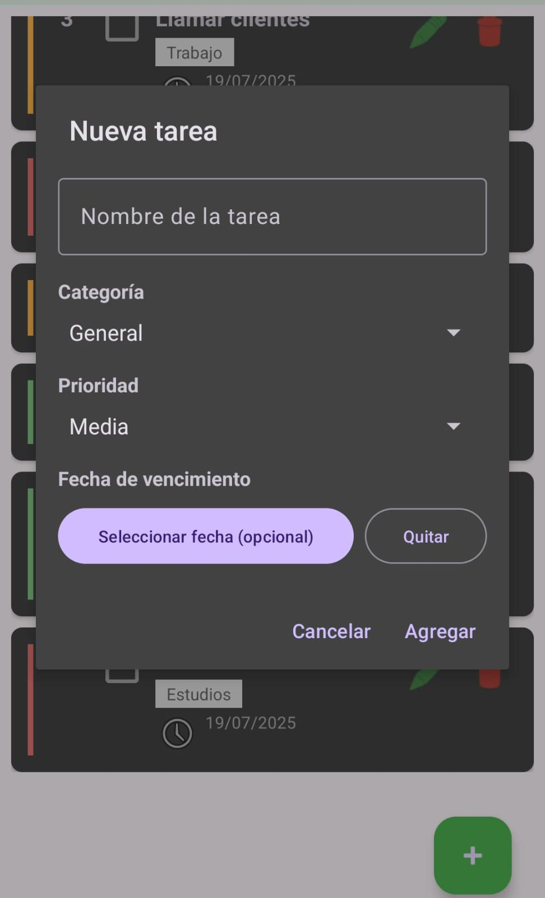
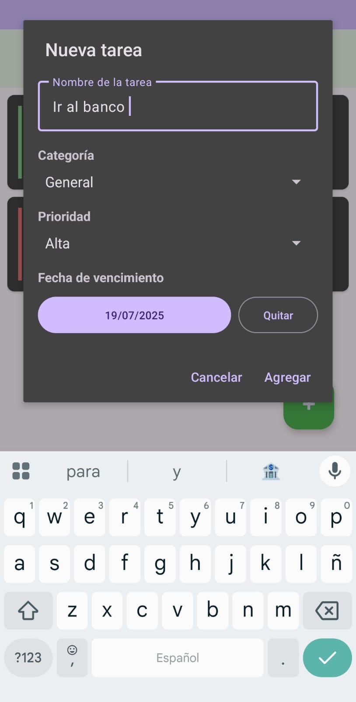

# Aplicación de lista de tareas

Breve descripción del proyecto:  
Aplicación básica para crear tareas con diferentes categorias.

## Instalación

Sigue estos pasos para instalar y ejecutar el proyecto en tu entorno local:

1. **Clona el repositorio:**
   ```bash
   git clone https://github.com/0Paola0/AppListaTareas
   ```

2. **Abre el proyecto en Android Studio:**
   - Abre Android Studio.
   - Selecciona `File > Open` y busca la carpeta del proyecto que clonaste.

3. **Configura el entorno:**
   - Instala las dependencias necesarias (Android SDK, plugins, etc).
   - Asegúrate de tener configurado un emulador o un dispositivo físico.

4. **Ejecuta la aplicación:**
   - Haz clic en el botón "Run" (`▶️`) en Android Studio.

## Imágenes

1. **Pantalla de inicio**



2. **Agregar nueva tarea**


3. **Editar una tarea**


3. **Tareas Completadas**

